# Filtering Operators

---

## 시작에 앞서..

- .next를 굳이 다 받고 싶지 않아?
- Array filter(_:)랑 비슷한 느낌인 이녀석을 쓰자.

## Ignoring operators

1. ignoreElements()

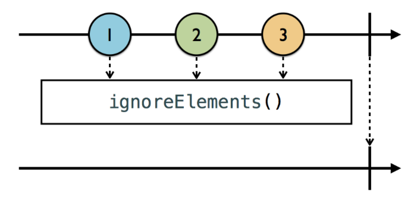

- 이친구는 .next는 무시, .completed, .error등의 정지 이벤트만 받는다.

```swift
            example(of: "ignoreElements") {
                
                let strikes = PublishSubject<String>.init()
                let disposeBag = DisposeBag()
                
                strikes
                    .ignoreElements()
                    .subscribe({ _ in
                        print("You're out!")
                    })
                    .disposed(by: disposeBag)
                
                // .next 이벤트를 던져
                strikes.onNext("X")
                strikes.onNext("X")
                strikes.onNext("X")
                
                // . completed 이벤트를 던져
                strikes.onCompleted()
            }

//=============== --- Example of: ignoreElements ---
You're out!
```

- .next는 싸그리 무시되기때문에 print가 실행 안됨.
- .completed 이벤트는 처리 되기때문에 이걸 방출 했을때 pinrt 가 실행된다.

2. elementAt()

- 몇번째로 오는 .next 이벤트만 허용하겠다임.
- 0 번째 index 부터 차례대로 인식한다.
- 아래 출력 결과를 보면 확연하게 알수 있는거죠~

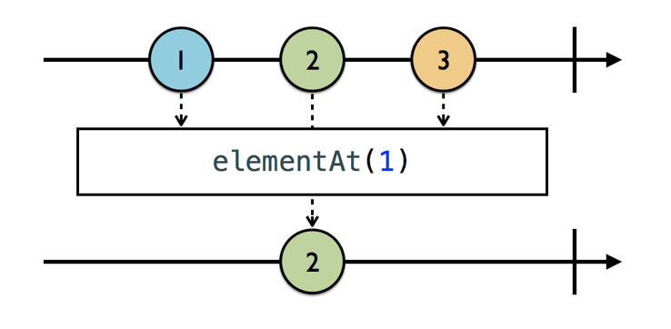

```swift
            example(of: "elementAt") {
                
                let strikes = PublishSubject<String>()
                let disposeBag = DisposeBag()
                
                strikes
                    .elementAt(1)
                    .subscribe(onNext: { _ in
                        print("You're out!")
                    })
                    .disposed(by: disposeBag)
                
                strikes.onNext("X")
                print("1번 지나고 2간다~")
                strikes.onNext("X")
                print("2번 지나고 3간다~")
                strikes.onNext("X")
            }


--- Example of: elementAt ---
1번 지나고 2간다~
You're out!
2번 지나고 3간다~

```

3. filter

- 필터해야될 요구사항이 하나 이상일때 사용.

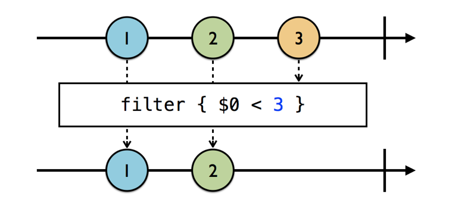

- 그림에서처럼 1, 2 이벤트만 방출된다. 3보다 작은놈이 참이니까~

```swift
//even filter..
             example(of: "filter") {
                
                let disposeBag = DisposeBag()
                
                // 1
                Observable.of(1,2,3,4,5,6)
                    // 2
                    .filter({ (int) -> Bool in
                        int % 2 == 0
                    })
                    // 3
                    .subscribe(onNext: {
                        print($0)
                    })
                    .disposed(by: disposeBag)
            }
            
--- Example of: filter ---
2
4
6

```
- Array의 filter와 매우 흡사하져~

## Skipping Operators

1. skip

- 확실히 몇개까지의 element를 skip할지 알고있을때.

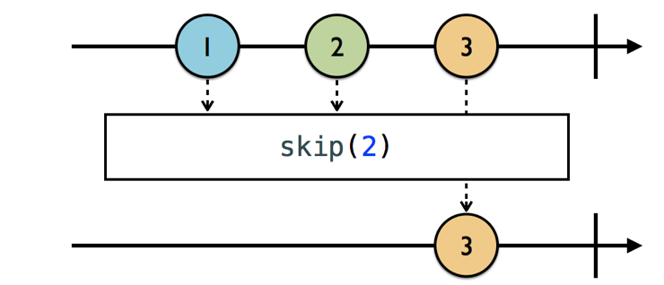

```swift
            example(of: "skip") {
                let disposeBag = DisposeBag()
                
                // 1
                Observable.of("A", "B", "C", "D", "E", "F")
                    // 2
                    .skip(3)
                    .subscribe(onNext: {
                        print($0)
                    })
                    .disposed(by: disposeBag)
            }
            
--- Example of: skip ---
D
E
F

```

- 넘나 명확해서 해석은 생략


2. skipWhile

- 관문 맹키로 조건이 false가 되면 그이후로는 다 통과!

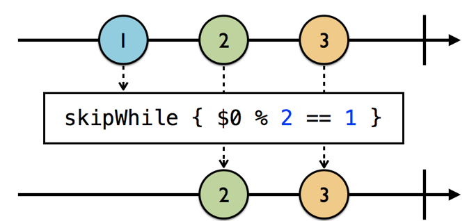

```swift
            example(of: "skipWhile") {
                
                let disposeBag = DisposeBag()
                
                // 1
                Observable.of(2, 2, 3, 4, 4)
                    //2
                    .skipWhile({ (int) -> Bool in
                        int % 2 == 0
                    })
                    .subscribe(onNext: {
                        print($0)
                    })
                    .disposed(by: disposeBag)
            }
            
--- Example of: skipWhile ---
3
4
4
```

- 홀수인 요소가 나올 때까지 skip하기 위해 skipWhile 을 사용한다. false가 된 이후로는 ? 알지?

3. skipUntil

- 고정된 observable 하나 만 보고 skip하던게 아니라 다른 observable에 기반해서 다이나믹하게 필터하고 싶을때.

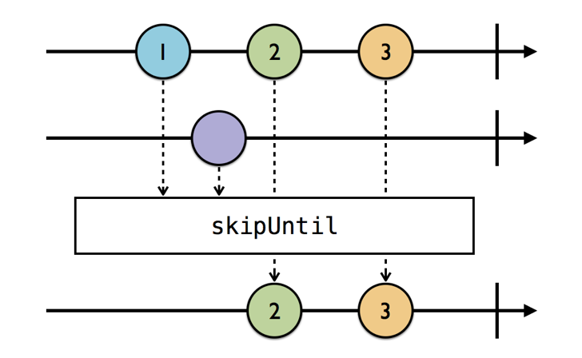

- skipUnitl은 다른 observable이 시동할 때까지 현재 observable에서 방출하는 이벤트를 skip 한다.
	- 그니까 그림을 보면 다른 옵져버블에서 이벤트가 발행된 이후부터 해당 옵져버블로부터의 이벤트를 구독하는거지

```swift
 example(of: "skipUntil") {
     let disposeBag = DisposeBag()
     
     // 1
     // subject는 기준 옵져버블
     // trigger가 skipUntil에서 주시할 옵져버블
     let subject = PublishSubject<String>()
     let trigger = PublishSubject<String>()
     
     // 2
     subject
         .skipUntil(trigger)
         .subscribe(onNext: {
             print($0)
         })
         .disposed(by: disposeBag)
     
     // 3
     // 무시됨
     subject.onNext("A")
     subject.onNext("B")
     
     // 4
     // 이건 주시될 옵져버블에 이벤트가 발행된거임
     trigger.onNext("X")
     
     // 5
     // 이건 그럼 무시안됨.
     subject.onNext("C")
 }
 --- Example of: skipWhile ---
3
4
4
```

## Taking Operators

1. take

- skip의 반대 개념
	- 거르는게 아니라 취하는거지
	- 여기서 취한다 == 반응한다 약속한다.

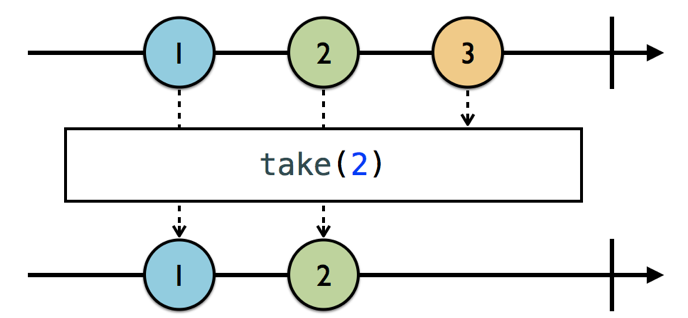

- 명시한 인덱스까지의 이벤트 발행된것만 반응 할게여 라고 약속하는거야

```swift
 example(of: "take") {
     let disposeBag = DisposeBag()
     
     // 1
     // 6개 발행해
     Observable.of(1,2,3,4,5,6)
         // 2
         // 3개까지 발행을 반응하겠다 하는거
         .take(3)
         .subscribe(onNext: {
             print($0)
         })
         .disposed(by: disposeBag)
 }
 
 --- Example of: take ---
1
2
3
```

2. takeWhile
- takeWhile은 skipWhile 처럼 작동.

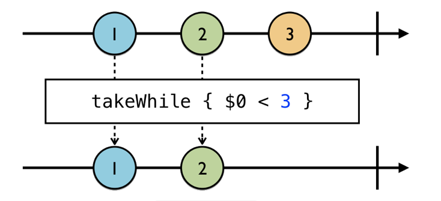

- true되는 조건들만 취하는거지..

- enumerated
	- 방출된 요소의 index를 참고하고 싶을때
	- 기존 Swift의 enumerated 메소드와 유사하게, Observable에서 나오는 각 요소의 index와 값을 포함하는 튜플을 생성하게 된다.

```swift
            example(of: "takeWhile") {
                let disposeBag = DisposeBag()
                
                // 1
                // 6개 이벤트 발행
                Observable.of(2,2,4,4,6,6)
                    // 2
                    //방출될때 enum처럼 인덱스를 다 붙여줘 방출되는 이벤트에
                    .enumerated()
                    // 3
                    //짝수고 index가 3미만인 이벤트 방출에만 반응할게요
                    .takeWhile({ index, value in
                        value % 2 == 0 && index < 3
                    })
                    // 5
                    // 이친구들의 element만 따로 때서 생각하고싶어요
                    .map { $0.element }
                    .subscribe(onNext: {
                        print($0)
                    })
                    .disposed(by: disposeBag)
            }
--- Example of: takeWhile ---
2
2
4
```
4. takeUntil

- skipUntil과 다르게 정반대로 주시하는 다른 옵져버블의 이벤트 방출이 이뤄지기 전까지만 이벤트에 반응

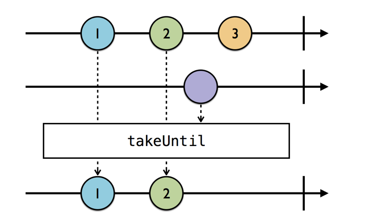


```swift
example(of: "takeUntil") {
     let disposeBag = DisposeBag()
     
     // 1
     let subject = PublishSubject<String>()
     let trigger = PublishSubject<String>()
     
     // 2
     subject
         .takeUntil(trigger)
         .subscribe(onNext: {
             print($0)
         })
         .disposed(by: disposeBag)
     
     // 3
     subject.onNext("1")
     subject.onNext("2")
     
     // 4
     trigger.onNext("X")
     
     // 5
     subject.onNext("3")
 }
--- Example of: takeUntil ---
1
2
```

- 사용 예시
	- dispose Bag에 dispose를 추가하는게 아니라 얘를 통해 구독을 멈출 수 있따.

```swift
 someObservable
 	.takeUntil(self.rx.deallocated)
 	.subscribe(onNext: {
 		print($0)
 	})
```
- 반응을 멈춰야 되는 그 trigger 역할을 self의 할당해제가 맡게 된다. 보통 self는 아마 뷰컨트롤러나 뷰모델이 된단다..

## Distinct Operators

1. distinctUntilChanged

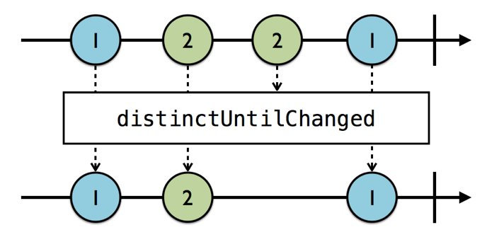

- 중복해서 연달아 오는 이벤트는 반응하지 않겠어 라고 하는거임

```swift
            example(of: "distincUntilChanged") {
                let disposeBag = DisposeBag()
                
                // 1
                Observable.of("A", "A", "B", "B", "A")
                    //2
                    .distinctUntilChanged()
                    .subscribe(onNext: {
                        print($0)
                    })
                    .disposed(by: disposeBag)
            }

--- Example of: distincUntilChanged ---
A
B
A
```

2. distinctUntilChanged(_:)

- distinctUntilChanged는 기본적으로 구현된 로직에 따라 같음을 확인한다. 그러나 커스텀한 비교로직을 구현하고 싶다면 distinctUntilChanged(_:)를 사용할 수 있다.

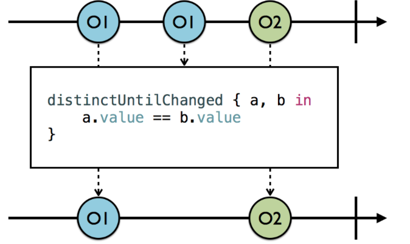

- 그림은 value라 명명된 값을 서로 비교하여 중복되는 값을 제외하고 있다.
	- 이와 같이 기존에 걍 중복된 이벤트 반응 안해! 이게 아니라 몇몇의 중복이벤트는 넘겨도 되 같은느낌으로.

```swift
 example(of: "distinctUntilChanged(_:)") {
                let disposeBag = DisposeBag()
                
                // 1
                //각각의 번호를 배출해내는 NumberFormatter()를 만들어낸다.
                let formatter = NumberFormatter()
                formatter.numberStyle = .spellOut
                
                // 2
                //NSNumbers Observable을 만든다. 이렇게 하면 formatter를 사용할 때 Int를 변환할 필요가 없다.
                Observable<NSNumber>.of(10, 110, 20, 200, 210, 310)
                    // 3
                    //distinctUntilChanged(_:)는 각각의 seuquence 쌍을 받는 클로저다.????
                    .distinctUntilChanged({ a, b in
                        //4
                        //guard문을 통해 값들의 구성요소를 빈 칸 구분하여 조건부로 바인딩하고 그렇지 않으면 false를 반환한다.
                        guard let aWords = formatter.string(from: a)?.components(separatedBy: " "),
                            let bWords = formatter.string(from: b)?.components(separatedBy: " ") else {return false}
                        
                        var containsMatch = false
                        
                        // 5
                        //중첩 for-in 반복문을 통해서 각 쌍의 단어를 반복하고, 검사결과를 반환하여, 두 요소가 동일한 단어를 포함하는지 확인한다
                        for aWord in aWords {
                            for bWord in bWords {
                                if aWord == bWord {
                                    containsMatch = true
                                    break
                                }
                            }
                        }
                        
                        return containsMatch
                    })
                    // 6
                    .subscribe(onNext: {
                        print($0)
                    })
                    .disposed(by: disposeBag)
            }
--- Example of: distinctUntilChanged(_:) ---
10
20
200

```


